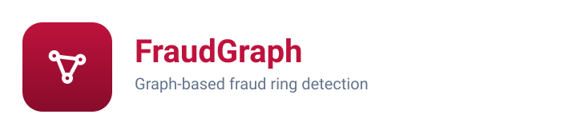
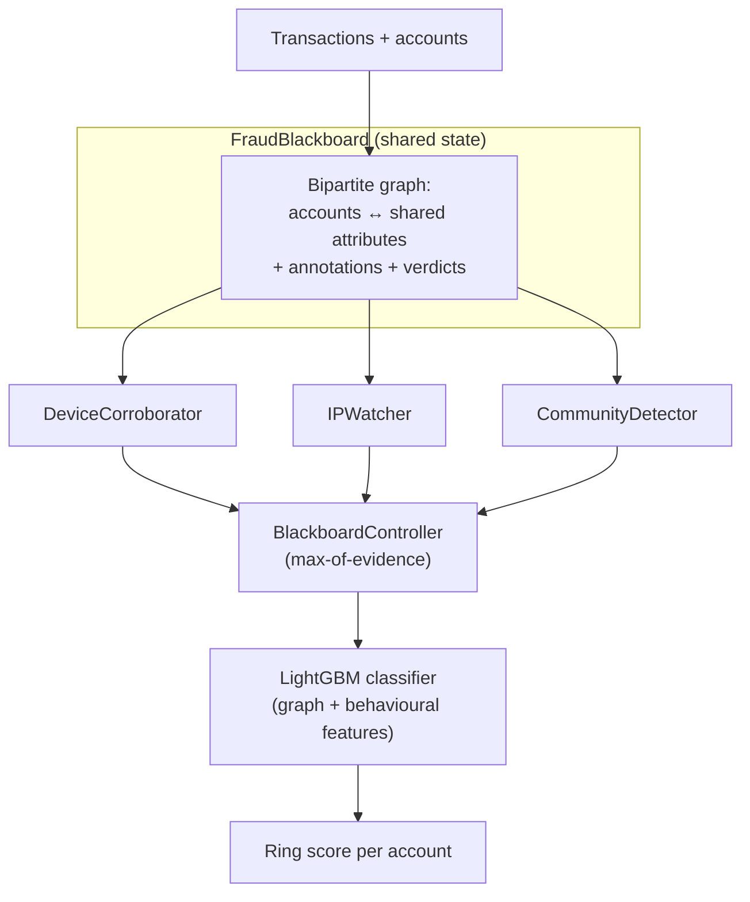

<div align="center">



</div>

# FraudGraph — Graph-Based Fraud Ring Detection

**Catch fraud *rings*, not just fraudulent accounts.** FraudGraph links accounts through the attributes they share — devices, addresses, payees — and finds the tight clusters that individual-account scoring misses. Each fraud signal is an independent, hot-swappable detector reading from one shared account graph, so you can add a new signal without touching the others.

<div align="center">

[](https://www.python.org/)
[](https://fastapi.tiangolo.com/)
[](https://pytest.org/)
[](https://opensource.org/licenses/MIT)

</div>

> **Portfolio project.** Built to demonstrate graph modelling and the Blackboard architecture on realistic (synthetic) transaction data. Not hardened for production use.

---

## The problem

Classic fraud scoring treats each account independently: score the transaction, score the user, flag the outliers. But organised fraud isn't independent — a ring registers dozens of accounts that quietly **share** infrastructure: the same device fingerprint, the same shipping address, the same payee. Any single account looks ordinary. The *pattern between them* is the tell.

FraudGraph reframes detection as a **graph problem**: build the account-to-attribute graph, then let several independent detectors look for structure — reused devices, address clusters, and dense communities — before a classifier combines the graph signal with ordinary behavioural features.

## How it works

Fraud is a multi-signal problem, and hard-coding every signal into one scorer produces an untestable tangle where changing one rule breaks another. FraudGraph uses the **Blackboard architecture** to keep signals independent:



- **Blackboard** (`FraudBlackboard`) — a shared, mutable structure holding the NetworkX account↔attribute graph plus annotation and verdict dictionaries. Detectors only ever read and write here.
- **Knowledge Sources** — independent detectors, each contributing exactly one perspective. They don't know about each other.
- **Controller** (`BlackboardController`) — runs the Knowledge Sources and aggregates their signals.

### Knowledge Sources

| Knowledge Source | Signal | Method |
|---|---|---|
| `DeviceCorroborator` | Co-registered device fingerprints | Groups accounts by `device_id`; flags clusters at/above a threshold |
| `IPWatcher` | Shared address / IP reuse | Groups by `address_id`; signals address-reuse rings |
| `CommunityDetector` | Dense graph communities | Community detection on the corroborated subgraph (edge weight ≥ 2) |

### Scoring

Signals combine by **max-of-evidence** — one strong signal is enough to flag an account for review:

```python
aggregate_score = max(ks_signal for ks in contributing_sources)
```

This is deliberately conservative: the Knowledge Sources are tuned to be precision-focused, so a single confident detector is treated as sufficient grounds for a human to look.

## Graph model

Accounts and attributes form a bipartite graph. The **edge weight** between two accounts is the number of attributes they share:

$$w(u, v) = \left| \{\, a : a \in \mathcal{A}_u \cap \mathcal{A}_v \,\} \right|$$

The **corroborated subgraph** keeps only edges with $w(u, v) \geq 2$. A single coincidental overlap is common; two independent co-registrations by chance is rare, which makes the corroborated subgraph a strong ring signal. Graph features (degree, connected-component size, clustering coefficient, multi-edge count) are then concatenated with behavioural features and fed to a LightGBM classifier.

## Getting started

```bash
uv sync --group dev          # install
uv run pytest                # run the test suite

make api                     # FastAPI on http://localhost:8140
make ui                      # Streamlit dashboard on http://localhost:8641
```

Or with Docker:

```bash
make docker-up               # docker compose up --build -d
```

### Use the Blackboard directly

```python
from fraudgraph.blackboard import BlackboardController, FraudBlackboard

bb = FraudBlackboard(accounts=accounts_df, graph=g)
scores = BlackboardController().run(bb)   # {account_id: fraud_signal}
```

Adding a new signal requires **no changes to existing detectors** — register another Knowledge Source:

```python
from fraudgraph.blackboard import KnowledgeSource

class VelocityWatcher(KnowledgeSource):
    name = "velocity_watcher"
    def contribute(self, bb): ...

controller.register(VelocityWatcher())
```

## API

| Method | Route | Purpose |
|---|---|---|
| `GET` | `/health` | Liveness check |
| `GET` | `/score/{account_id}` | Aggregated ring score + per-detector reasons for one account |
| `GET` | `/rings` | Suspected rings (dense corroborated components) |
| `GET` | `/component/{component_id}` | Accounts and edges in a specific component |

## Evaluation

Evaluation runs on synthetic transaction data with injected fraud rings, so there is a known ground truth to measure against. The training script reports precision/recall and PR-AUC for the LightGBM classifier and compares behavioural-only features against behavioural + graph features to quantify the lift the graph provides. To reproduce:

```bash
uv run python -m fraudgraph.models.train   # trains and prints the evaluation report
```

Numbers are omitted here because they depend on the generated dataset and seed; run the script to produce them for your configuration.

## Testing

```bash
uv run pytest --cov
```

- `test_blackboard.py` — Knowledge Sources and controller aggregation
- `test_graph.py` — graph construction and feature extraction
- `test_api.py` — HTTP contract tests

## Limitations

- Detection quality depends on attribute coverage — rings that share no observable attributes are invisible to the graph signals.
- Community detection is sensitive to the edge-weight threshold; the default (≥ 2) trades recall for precision.
- The bundled data is synthetic; thresholds would need recalibration on real transaction distributions.

## Project structure

```
src/fraudgraph/
├── blackboard/   # Blackboard + Knowledge Sources + controller (the core)
├── graph/        # Bipartite graph construction and features
├── models/       # LightGBM training and evaluation
├── api/          # FastAPI app (main:app) and routes
└── ui/           # Streamlit dashboard
```

## License

MIT

---

<div align="center">

**Jackson Marcus** · Senior AI & Machine Learning Engineer

[](https://github.com/jackson-marcus)
[](mailto:wajahatanees41@gmail.com)

</div>
