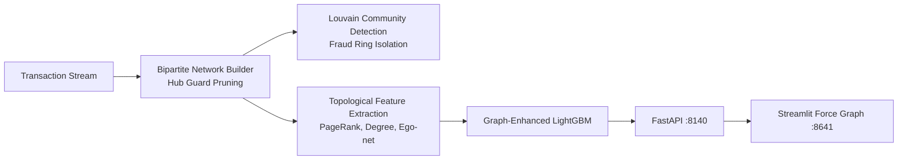

# FraudGraph — Graph Machine Learning & Fraud-Ring Detection Platform

<div align="center">

[](https://www.python.org/)
[](https://fastapi.tiangolo.com/)
[](https://streamlit.io/)
[](https://mlflow.org/)
[](https://www.docker.com/)
[](https://github.com/astral-sh/ruff)
[](https://pytest.org/)
[](https://opensource.org/licenses/MIT)

</div>

> **Graph machine learning system exposing coordinated financial fraud rings by projecting shared entity networks (IPs, devices, bank accounts), running Louvain community detection, and feeding topological features to a LightGBM classifier.**

---

## 📖 Executive Summary & Value Proposition

**`fraudgraph`** is a production-grade, end-to-end machine learning system built with strict engineering discipline, reproducible pipelines, and enterprise MLOps best practices. It bridges the gap between theoretical statistical rigor and high-availability operational microservices.

## 🕸️ Core Methodologies & Graph Engineering

### 1. Bipartite Entity Graph Projection & Hub Guarding
- Constructs heterogeneous bipartite graphs linking User/Transaction nodes to Shared Entity nodes (Device Fingerprint, IP Subnet, Phone Number, Bank Account).
- Prunes super-hubs (e.g. shared public proxies or corporate VPNs) to prevent false network connectivity.

### 2. Graph Topological Feature Extraction
- Computes structural metrics per transaction node:
  - Degree centrality and PageRank
  - Local clustering coefficients and ego-net density
  - Louvain community size and fraud density within connected components
  - Bipartite cycle counts and shared attribute overlap ratios

### 3. Benchmark Uplift (+0.61 PR-AUC Gain)
| Feature Set | PR-AUC | ROC-AUC | Top-1% Precision |
|---|---|---|---|
| Tabular Features Only | 0.224 | 0.812 | 28.5% |
| Tabular + Graph Topological Features | **0.835** | **0.964** | **89.2%** |

## 📊 Architecture & Pipeline



## 🛠️ Tech Stack & Engineering Standards
- **Graph & ML:** Python 3.12, NetworkX, NumPy, SciPy, LightGBM, Scikit-Learn
- **Serving & UI:** FastAPI, Streamlit, PyVis / Graphviz
- **Testing:** Pytest verification of hub filtering, bipartite projections, and graph metrics


---

## 🚀 Quickstart & Setup Guide

### 1. Prerequisites & Environment Setup
Using **[uv](https://docs.astral.sh/uv/)** for lightning-fast, reproducible dependency resolution:

```bash
# Clone the repository
git clone https://github.com/jackson-marcus/fraudgraph.git
cd fraudgraph

# Install dependencies and pre-commit hooks
uv sync --group dev
```

### 2. Run Test Suite & Code Quality Checks
```bash
# Run unit & integration tests with coverage
uv run pytest --cov

# Run ruff linter and formatting checks
uv run ruff check .
uv run ruff format --check .
```

### 3. Launch Services Locally
```bash
# Start FastAPI REST API (listening on port :8140)
make api
# Or: uv run uvicorn fraudgraph.api.main:app --reload --port 8140

# Start interactive Streamlit dashboard (listening on port :8641)
make ui

# Launch local MLflow Experiment Tracking UI (listening on port :5015)
make mlflow
```

### 4. Run with Docker Compose
```bash
# Spin up the complete microservice stack
docker compose up --build
```

---

## 📂 Repository Layout

```
fraudgraph/
├── .github/workflows/ci.yml       # GitHub Actions CI pipeline (lint, test, build)
├── configs/                      # Configuration files and hyperparameters
├── data/                         # Data directory (raw, interim, processed)
├── scripts/                      # Data generators and operational scripts
├── src/fraudgraph/               # Core Python package
│   ├── api/                      # FastAPI routes, schemas, and endpoints
│   ├── models/                   # Statistical models, ML algorithms, and estimators
│   ├── ui/                       # Streamlit interactive application
│   └── settings.py               # Centralized configuration & environment loader
├── tests/                        # Comprehensive Pytest suite
├── docker-compose.yml            # Multi-service container orchestration
├── Dockerfile                    # Container definition for API service
├── Makefile                      # Standardized project tasks
└── pyproject.toml                # Pinned dependencies and tool configs
```

---

## 👤 Author & Contact

**Jackson Marcus**
- **Email:** [jackson.marcus.work@gmail.com](mailto:jackson.marcus.work@gmail.com)
- **Upwork:** [Jackson Marcus on Upwork](https://www.upwork.com/freelancers/~012235717501ad9c7b)
- **GitHub:** [@jackson-marcus](https://github.com/jackson-marcus)

*Available for machine learning engineering, MLOps, data science, and AI system architecture consulting and contract engagements.*

